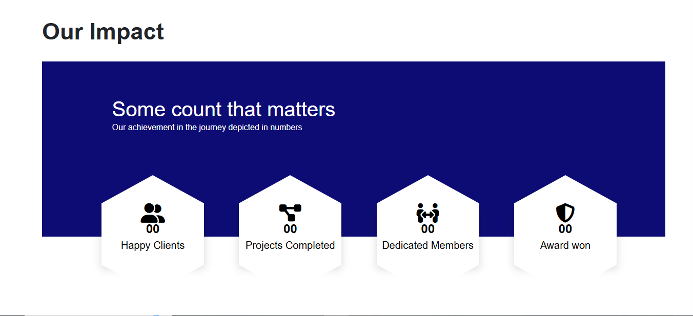
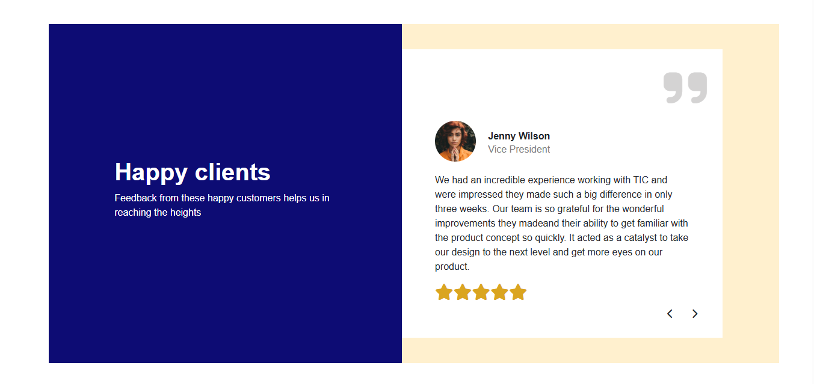
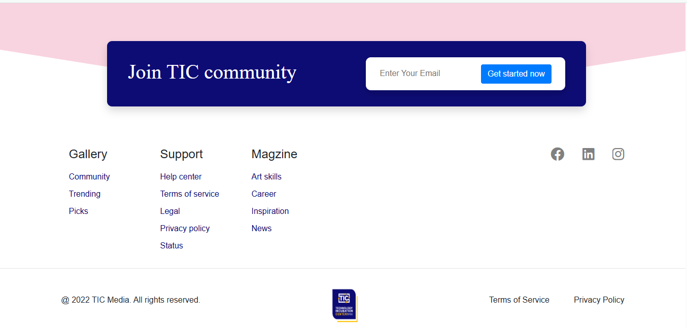

# Technology Incubation Center (TIC) - Landing Page

A responsive landing page developed for the **Technology Incubation Center (TIC)** — an initiative by the **IT Department, University of Sindh**. This project was assigned to me during my **final year** as part of academic work.

> _"TIC provides emerging entrepreneurs with the opportunity to start their own businesses by offering the necessary framework, infrastructure, mentorship, and both national and international networking opportunities to help them launch and grow their enterprises."_

---

## 📁 Project Structure

TIC-Landing-Page/

├── index.html # Homepage

├── mission.html # Mission statement page

├── team.html # Team introduction page

├── style.css # Main stylesheet

├── style_resp.css # Responsive styles (media queries)

├── images/ # Image assets used across pages

---

## 🌐 About the Project

The TIC landing page was built using **HTML5** and **CSS3**, with a focus on **responsiveness and clean UI**. It aims to present the mission, team, and purpose of the Technology Incubation Center in a professional and engaging format.

---

## 🎯 Features

- 📱 Fully responsive layout
- 🖼️ Clean design with dedicated pages for mission and team
- 🌐 Built with semantic HTML and modular CSS
- 🚀 Lightweight and fast-loading

---

## 🛠️ Tech Stack

- HTML5
- CSS3
- Media Queries for responsiveness

No external frameworks or libraries were used — this project is built from scratch to demonstrate frontend fundamentals.

---

## 📸 Screenshots

_(Add your screenshots here if available)_

## 👨‍💻 Author

Developed by Mehboob Hassan during the final year of studies at the University of Sindh.

##  License
This project is for academic and portfolio use.